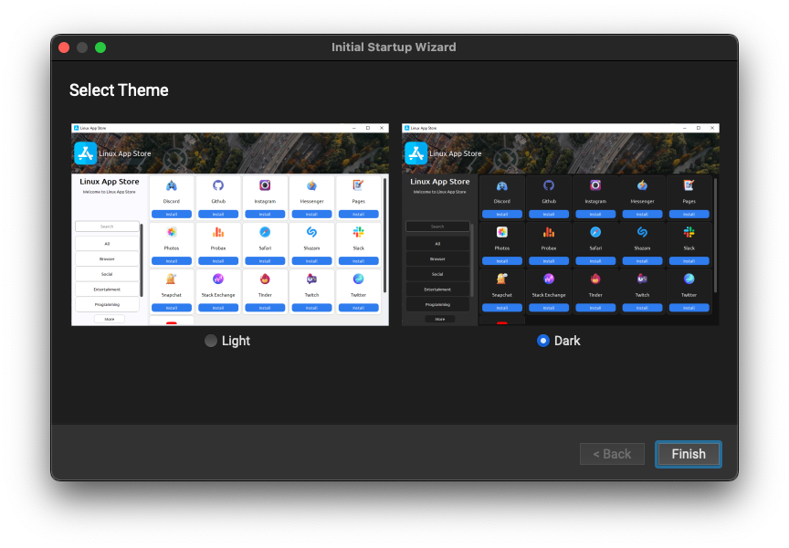
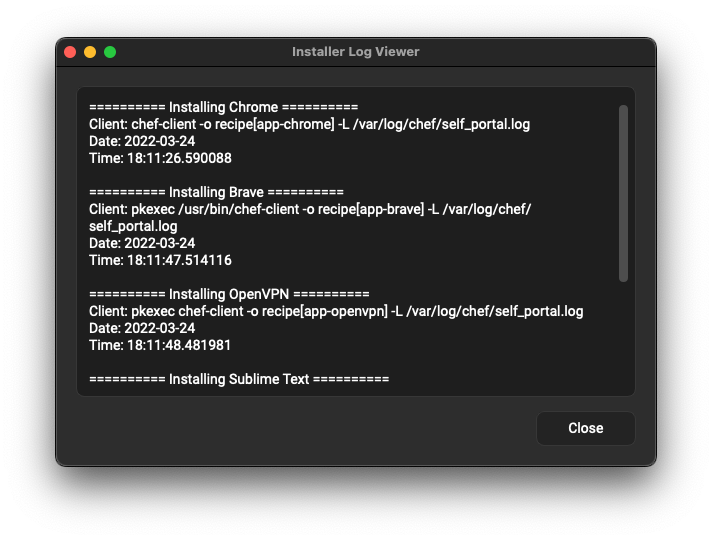
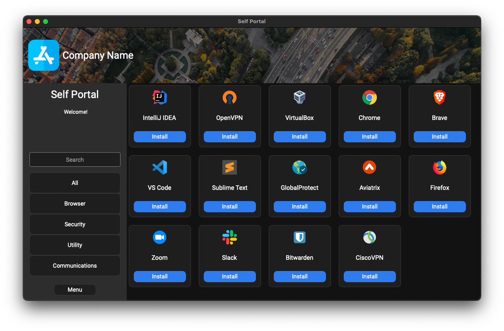
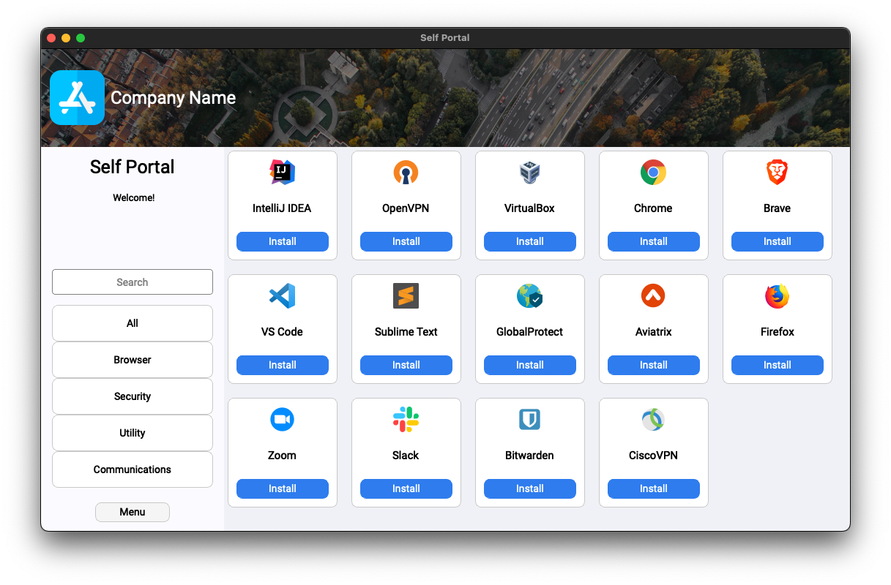
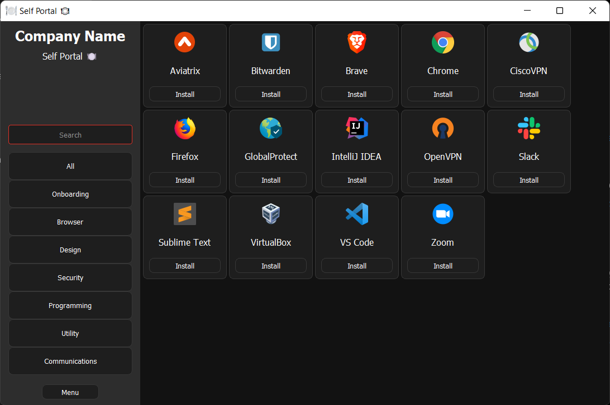
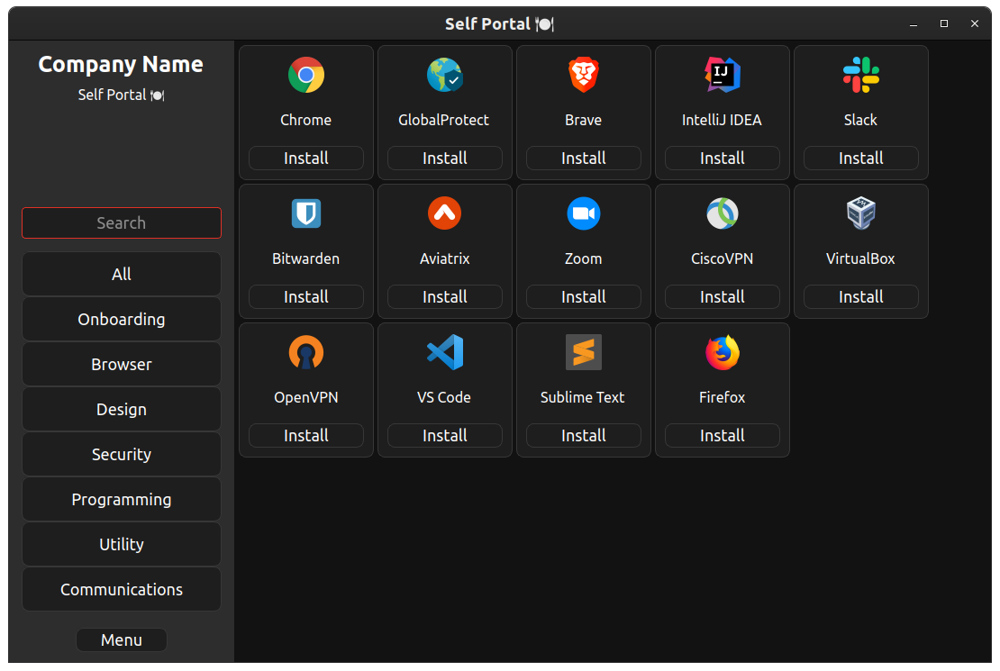
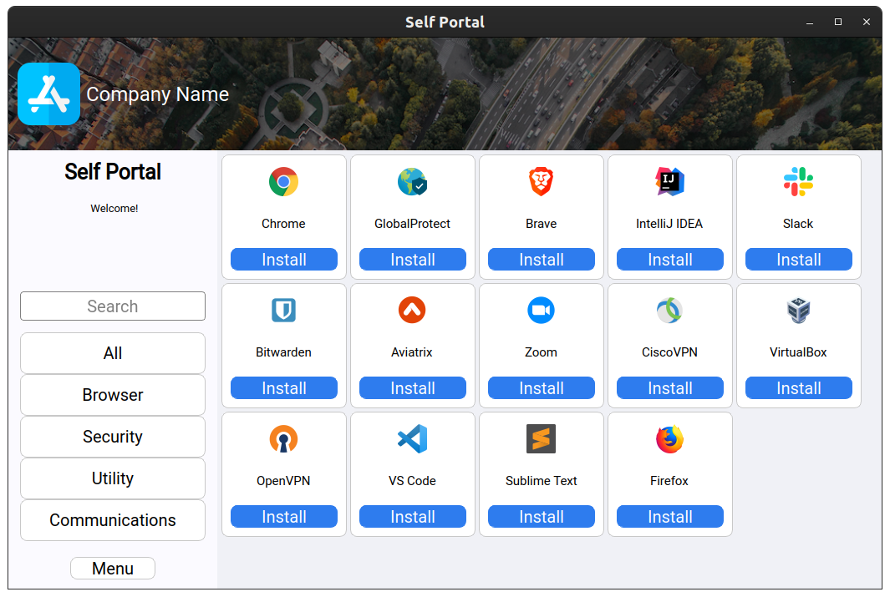

# Self Portal
##### Written by [Amado Tejada](https://www.linkedin.com/in/amadotejada/)
Self Portal is a **cross-platform** desktop application used to deploy software across your endpoints fleet while providing the same user experience across multiple software management solutions.

This is a front-end for users to install applications. Self Portal does not connect the software management tools. Instead, it calls out to the software management tool to install the packages.

*Self Portal is in beta*

<!-- To discuss Self Portal join the `#self-portal` channel on the [MacAdmins Slack](https://www.macadmins.org) -->

#### Features
* cross-platform
* supports various deployment tools
* python framework bundled
* no end-user runtime dependencies
* dark & light themes
* log viewer

#### Supports
Tested Self Portal with the toosl below:
| 
<i class="fa fa-apple"></i> macOS
 | 
<i class="fa fa-windows"></i> Windows
 | 
<i class="fa fa-linux"></i> Linux
               |
|:---------------------:|:---------------------:|:---------------------:|
| [Chef](https://github.com/chef/chef) | [Chef](https://github.com/chef/chef) | [Chef](https://github.com/chef/chef) |
| [Jamf](https://docs.jamf.com/technical-articles/Manually_Initiating_a_Policy.html) | [Choco](https://github.com/chocolatey/choco) | [apt](https://manpages.ubuntu.com/manpages/xenial/man8/apt.8.html)/[yum](https://man7.org/linux/man-pages/man8/yum.8.html)/[dnf](https://man7.org/linux/man-pages/man5/dnf.conf.5.html)     |
| [pip](https://pip.pypa.io/en/stable/getting-started/) | [pip](https://pip.pypa.io/en/stable/getting-started/) | [pip](https://pip.pypa.io/en/stable/getting-started/)
| [autopkg](https://github.com/autopkg/autopkg) | [Scoop](https://github.com/ScoopInstaller/Scoop) | [snap](http://manpages.ubuntu.com/manpages/bionic/man1/snap.1.html)/[flatpak](https://docs.flatpak.org/en/latest/using-flatpak.html) |

* Last tested: 04/21/22
* Chef only tool with extensive testing
* Testing compatibility with [Gorilla](https://github.com/1dustindavis/gorilla), [Munki](https://github.com/munki/munki/wiki/managedsoftwareupdate), and [Homebrew](https://github.com/Homebrew)

## User Interface

| Theme Chooser  | Log Viewer |
|:-----:|:-----:|
|    |    |

#### macOS
| Dark  | Light |
|:-----:|:-----:|
|    |    |
<!--  -->

#### Windows
| Dark  | Light |
|:-----:|:-----:|
|    |    |
<!--  -->

#### Linux
| Dark  | Light |
|:-----:|:-----:|
|    |    |
<!--  -->

## Getting Started
[Wiki - work in progress](https://github.com/amadotejada/self-portal/wiki)

##
#### Disclaimer

This software {Self Portal} has not been endorsed or supported by any of the software mentioned [above](#supports) and is in no way associated with them and/or its subsidiaries or affiliate.

#### License

Self Portal is released under the [Apache 2.0 License](https://github.com/amadotejada/self-portal/blob/main/LICENSE)
####
