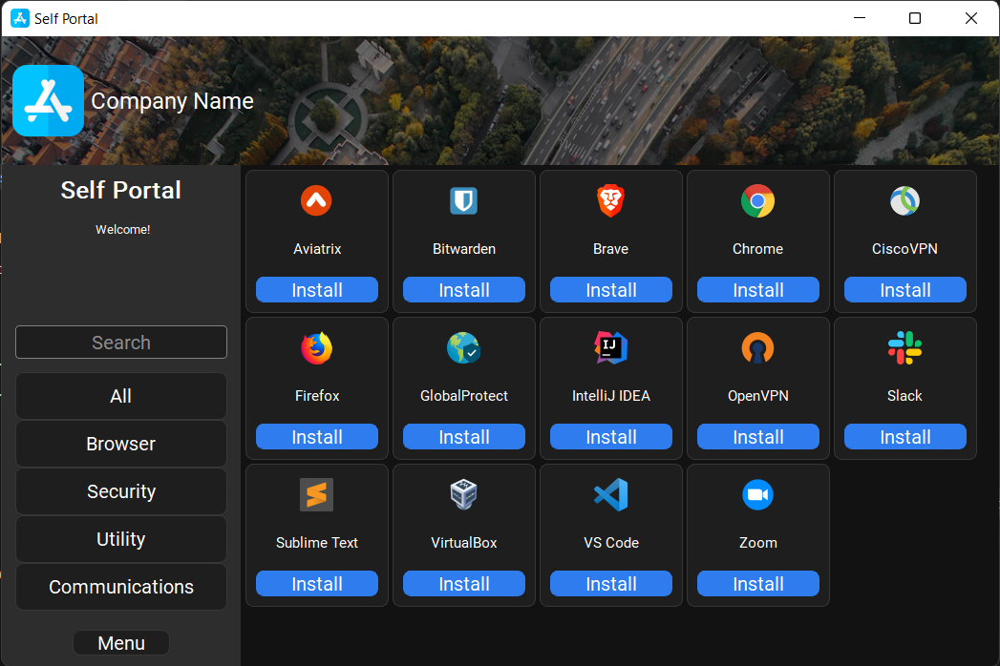
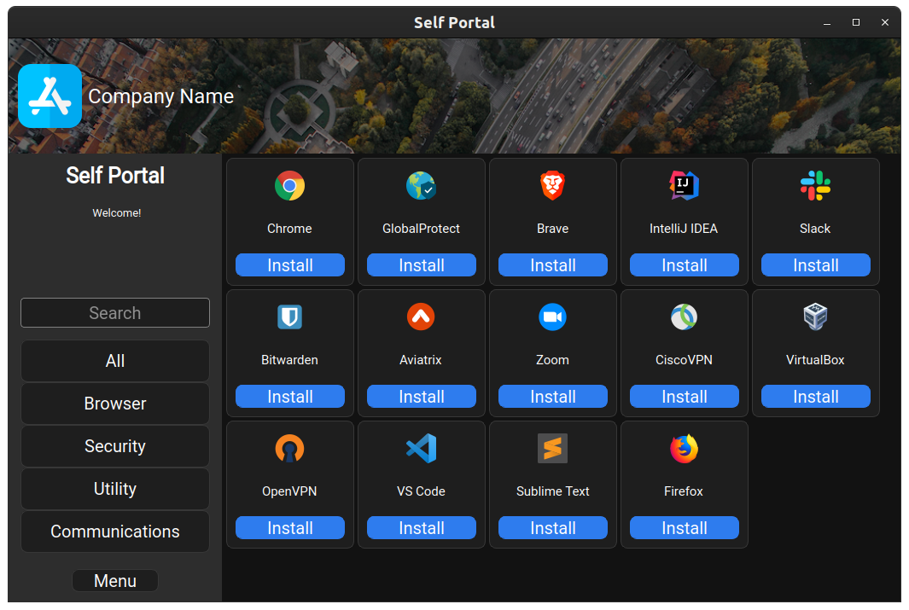

# Self Portal

##### Written by [Amado Tejada](https://www.linkedin.com/in/amadotejada/)

[](https://github.com/amadotejada/self-portal/actions/workflows/python.yml)

Self Portal is a **cross-platform** desktop application used to deploy software across your endpoints fleet while providing the same user experience across multiple software management solutions.

##


This is a front-end for users and does not connect directly with software management tools. Instead, it calls out to the software management tools [below](#supports) to install the packages.

Self Portal is in beta and should be tested extensively. 

<!-- To discuss Self Portal join the `#self-portal` channel on the [MacAdmins Slack](https://www.macadmins.org) -->

### Features

* cross-platform
* supports various deployment tools
* python framework bundled
* no end-user runtime dependencies
* dark & light themes
* log viewer

### Supports

| macOS | Windows | Linux |
|:---------------------:|:---------------------:|:---------------------:|
| [Chef](https://github.com/chef/chef) | [Chef](https://github.com/chef/chef) | [Chef](https://github.com/chef/chef) |
| [Jamf](https://docs.jamf.com/technical-articles/Manually_Initiating_a_Policy.html) | [Choco](https://github.com/chocolatey/choco) | [apt](https://manpages.ubuntu.com/manpages/xenial/man8/apt.8.html)/[yum](https://man7.org/linux/man-pages/man8/yum.8.html)/[dnf](https://man7.org/linux/man-pages/man5/dnf.conf.5.html)     |
| [pip](https://pip.pypa.io/en/stable/getting-started/) | [pip](https://pip.pypa.io/en/stable/getting-started/) | [pip](https://pip.pypa.io/en/stable/getting-started/)
| [autopkg](https://github.com/autopkg/autopkg) | [Scoop](https://github.com/ScoopInstaller/Scoop) | [snap](http://manpages.ubuntu.com/manpages/bionic/man1/snap.1.html)/[flatpak](https://docs.flatpak.org/en/latest/using-flatpak.html) |

* last tested: 04/21/22
* chef only tool with extensive testing
* testing [gorilla](https://github.com/1dustindavis/gorilla), [munki](https://github.com/munki/munki/wiki/managedsoftwareupdate), and [brew](https://github.com/Homebrew)

## User Interface

<details>
<summary>Preview UI Demo</summary>


</details>

### macOS

| Dark  | Light |
|:-----:|:-----:|
|    |    |

### Windows

| Dark  | Light |
|:-----:|:-----:|
|    |    |

### Linux

| Dark  | Light |
|:-----:|:-----:|
|    |    |

### Other

| Theme Chooser  | Log Viewer |
|:-----:|:-----:|
|    |    |

## Chef Requirements:
* [Chef](https://github.com/chef/chef) server and cookbooks needs to be pre-configured before using Self Portal.
* Cookbooks need to exist on Chef and scoped to the endpoints
* Node needs to be enrolled to the Chef instance.
 
## Self Portal Requirements:
* [pyinstaller](https://pypi.org/project/pyinstaller/) to build executables
* [PyQt5](https://pypi.org/project/PyQt5/) - Runtime files are bundled in executable for simple deployment.
* Create JSON file for each cookbook/app to deploy - see below.
* Self Portal needs to run with an admin account and the ability to run `chef-client` with elevated permissions.
  - Depending on your security posture and requirements.
  - There are several ways of doing this per OS. e.g. sudoers, [polkit](https://linux.die.net/man/8/polkit), [pkexec](https://linux.die.net/man/1/pkexec), [gsudo](https://github.com/gerardog/gsudo)

##### Apps JSON schema
```json
{
  "name": "Chrome",
  "id": "chrome",
  "description": "Chrome is a fast, secure, free web browser. The browser built by Google.",
  "category": ["browser"],
  "icon": "resources/icons/chrome.png",
  "bashcmd": "pkexec chef-client -o recipe[app_chrome] -L /var/log/chef/self_portal.log"
  \\ Self Portal calls the bashcmd to install the software via Chef.
}
```

## Build executables
- It's best to build on the targeted OS
```cmd
pyinstaller build.spec
```
Executables output to ```/self-portal/dist/```

##
### Disclaimer

This software {Self Portal} has not been endorsed or supported by any of the software mentioned [above](#supports) and is in no way associated with them and/or its subsidiaries or affiliate.

### License

Self Portal is released under the [Apache 2.0 License](https://github.com/amadotejada/self-portal/blob/main/LICENSE)
####
